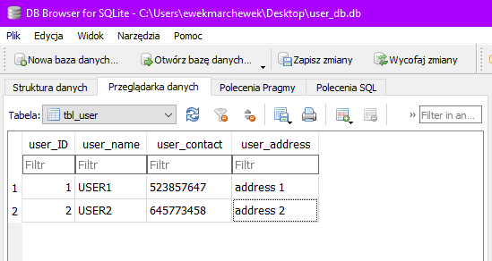
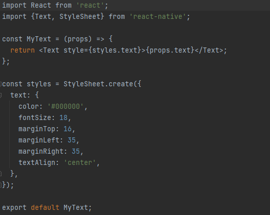
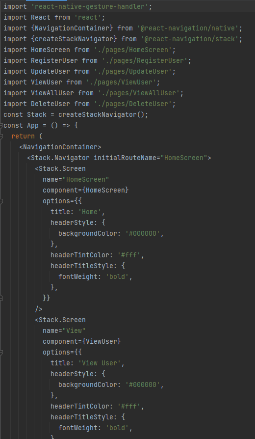

# Laboratorium 7 - wykorzystanie bazy danych w aplikacji mobilnej

Do stworzenia aplikacji wykorzystałam poradniki :
https://aboutreact.com/example-of-sqlite-database-in-react-native/
https://aboutreact.com/example-of-pre-populated-sqlite-database-in-react-native/

### Tworzenie bazy danych za pomoca DB Browsera  

### Dodawanie nowych rekordów do tabeli

### MyButton.js

### MyText.js

### MyTextInput.js

### App.js

### HomeScreen

### HomeScreen.js

### Register User

 

### Register User.js

### Update User

### UpdateUser.js

### View User

### ViewUser.js

### View All Users

### ViewAllUser.js

### Delete User

### DeleteUser.js

