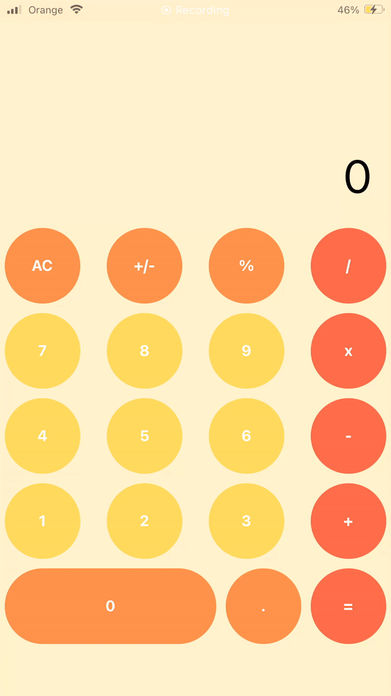
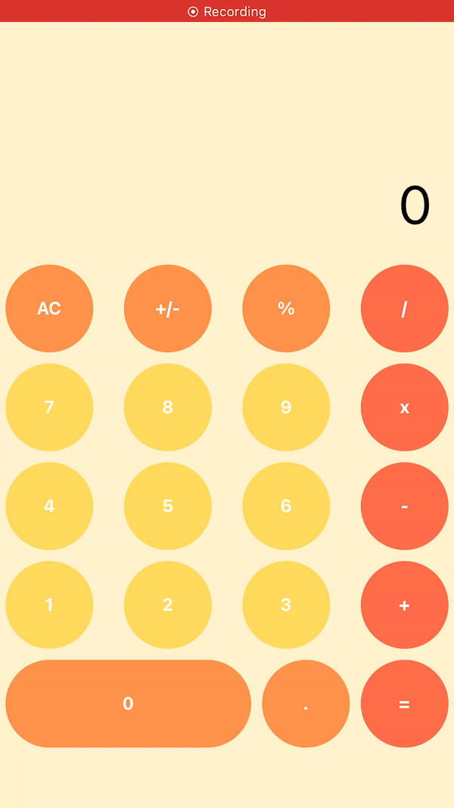

# Laboratorium 1 - Kalkulator.

Do stworzenia kalkulatora wykorzystałam Reacta, bibliotekę [SwissCalc](https://github.com/ericmorgan1/swisscalc-lib) oraz aplikację Expo Go (która pozwoliła mi na uruchomienie aplikacji na moim urządzeniu mobilnym z systemem iOS ).
Działanie aplikacji jest proste - opiera się na używaniu cyfr i operatorów działań matematycznych. 
Aby przedstawić działanie aplikacji utworzyłam gif'y, które pozwolą zobaczyć w jaki sposób wykonywana jest każda z dostępnych na kalkulatorze operacji.

Krótkie omówienie : W plikach CalcButton i CalcDisplay zawarte są parametry przyciskow kalkulatora, rozmiar czcionki, kolor, wielkosc przyciskow, ustawienie przezroczystosci przycisku po jego kliknięciu korzystajac z TouchableOpacity.
W folderze lib zawarta jest biblioteka, z której korzystam.
W pliku screens->CalculatorScreen.js zawarte są informacje jaki wynik defaultowy ma się wyświetlać na starcie bez wykonania zadnej operacji, czuwanie nad trybami wyświetlania (pionowym-portrait lub poziomym-landscape), kolor tla aplikacji, konfiguracja przycisków oraz ich personalizacja (możliwość zmiany koloru tła każdego z przycisków z osobna, koloru czcionki, tytułu i tak dalej) 
Prezentacja wykonywanych operacji :
### Operacja dodawania

### Operacja odejmowania

### Operacja mnożenia

### Operacja dzielenia

### Operacja procent

### Operacja znak +/-

