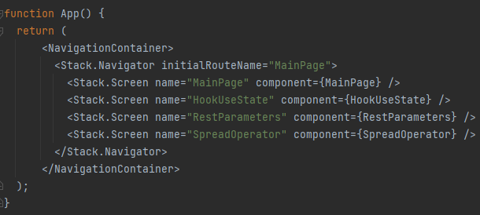
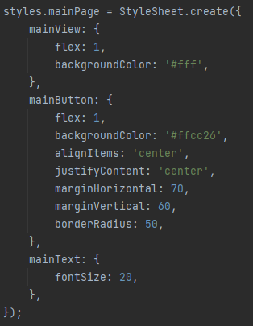
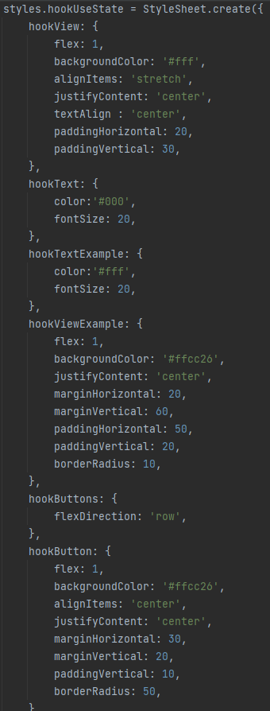
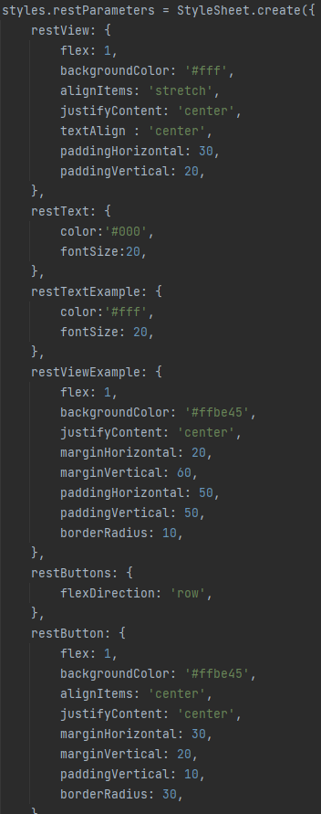
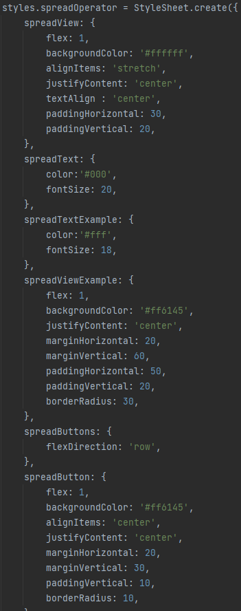

# Laboratorium 2 - responsywne layouty + nawigacja 

Do stworzenia aplikacji wykorzystałam Reacta i aplikację Expo Go 
(która pozwoliła mi na uruchomienie aplikacji na moim urządzeniu mobilnym z systemem iOS ).  
Na każdej stronie aplikacji położenie i kształty elemtów lekko się od siebie różnią ( zgodnie z poleceniem ), chociażby zaokrągleniem ramki,
różnice te nie są jednak bardzo duże, ponieważ chciałam zachować spójność w aplikacji. Działanie aplikacji na telefonie można zobaczyć na poniższym gifie :)

 

### W App.js użyte zostały react-navigator oraz stack-navigator  

  

### Main Page - czyli strona główna aplikacji  

  

#### Styl do Main Page  

  

### HookUseState  

  

#### Styl do HookUseState

  

### Rest Parameters  

  

#### Styl Rest Parameters  

  

### Spread Operator  

  

#### Styl Spread Operator

  