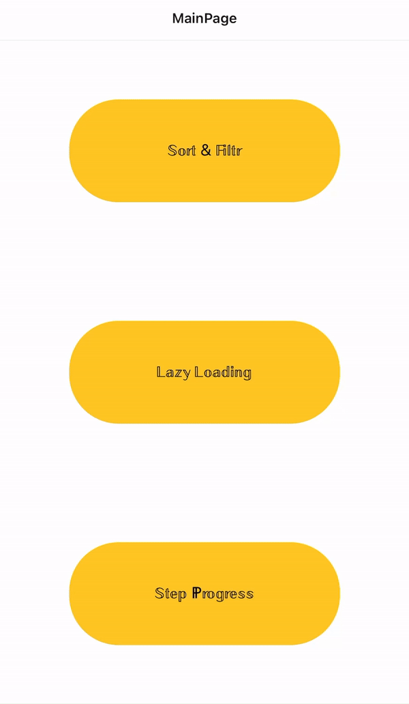
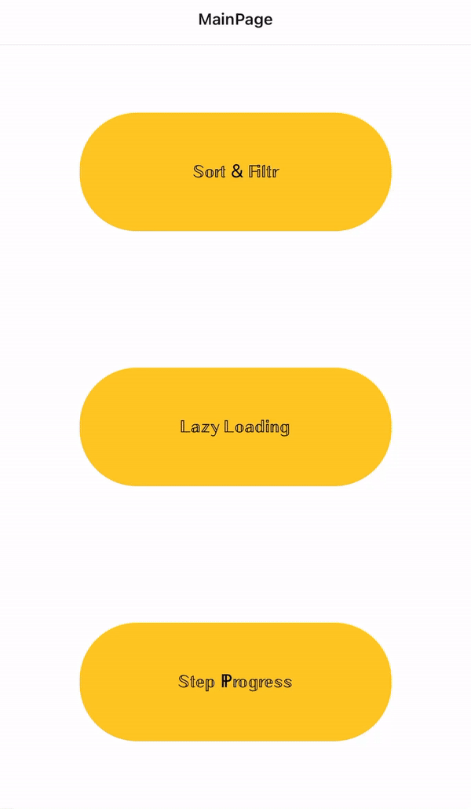
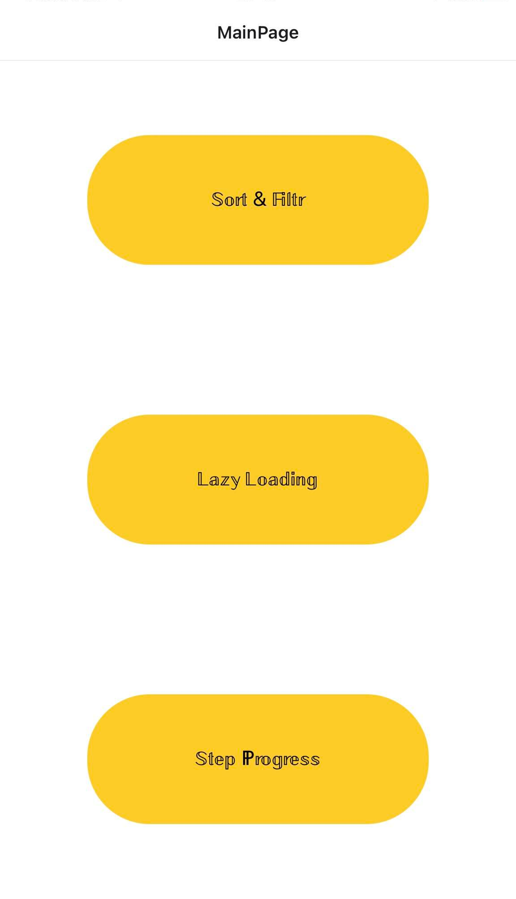
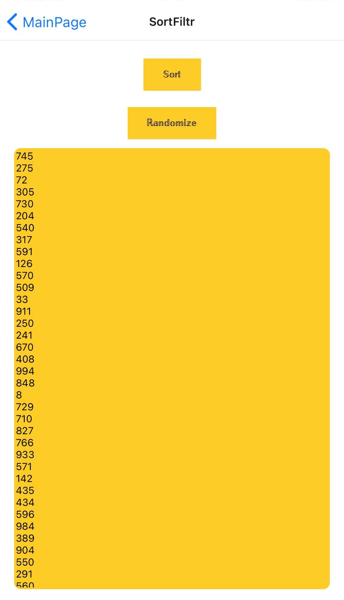
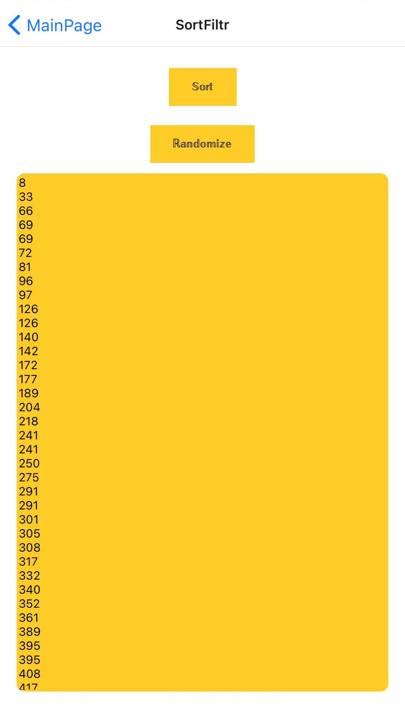
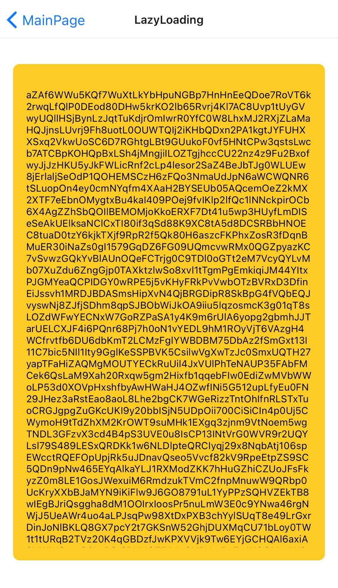
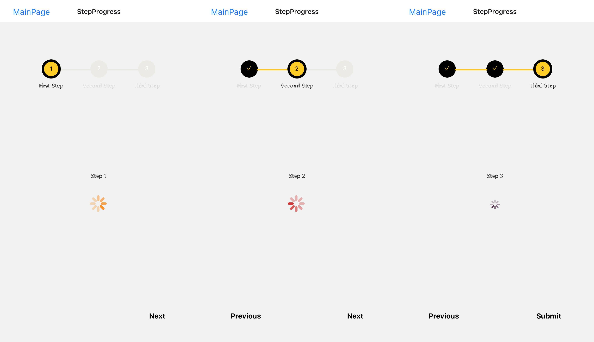

# Laboratorium 3 - renderowanie listy danych + obsługa progresu

Do stworzenia aplikacji wykorzystałam Reacta i aplikację Expo Go 
(która pozwoliła mi na uruchomienie aplikacji na moim urządzeniu mobilnym z systemem iOS). 
Działanie aplikacji na telefonie można zobaczyć na poniższych gifach.

 
 

### App.js code :

### Main Page :

### Sort & Filter code:

### Sort & Randomize :
  
  
### Lazy Loading code:

### Lazy Loading code :

### To Load code :

### Lazy Loading :

### Step Progression code:

### Step Progression :

### Step Progression :
  
