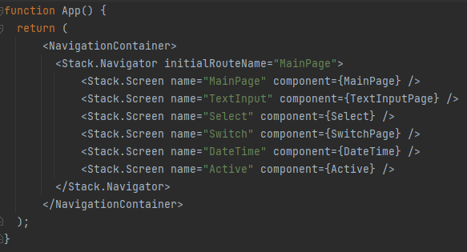

# Laboratorium 4 - obsługa danych wprowadzanych przez użytkownika + modale

Do stworzenia aplikacji wykorzystałam Reacta i aplikację Expo Go 
(która pozwoliła mi na uruchomienie aplikacji na moim urządzeniu mobilnym z systemem iOS).

### App.js :
 dodane zostały dwie nowe podstrony

### Main page :

### Text input :

input default - nie ma zadnych dodatkowych opcji
input placeholder - kiedy pole tekstowe nie jest wypełnione, to wyświetla się napis
input default value - wartosc domyslna zostaje wpisana
input multiline - pozwala na wprowadzenie wiecej, niz jednej linijki tekstu
input max length - maksymalna dlugosc znakow mozliwych do wprowadzenia ograniczona do 15
input numeric keyboard i secure text entry - przy kliknieciu na input pokazuje sie klawiatura numeryczna i zamiast wprowadzonych wartosci pokazane sa "*"
input editable false - edycja takiego inputu nie jest w ogole mozliwa

### Select:
   
W select'cie mozemy wybrac z listy zwierzęta i kolory
### Switch :

po przesunięciu switcha zostaje wyswietlana liczba pseudolosowa

### Date Time :
za pomocą przycisków jest możliwy wybór daty i czasu

 