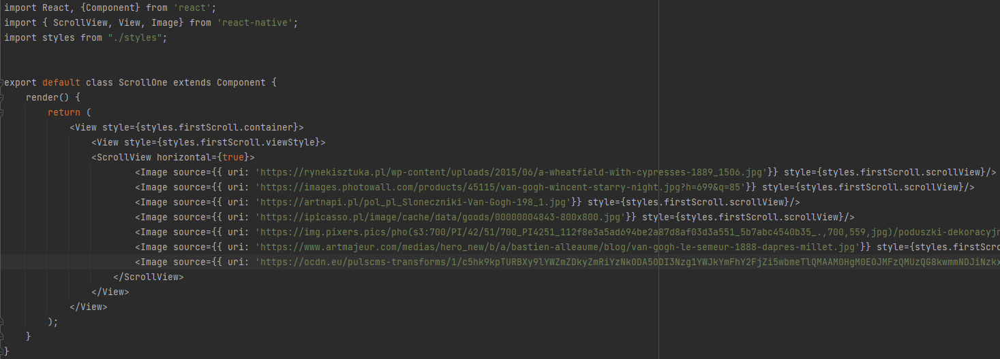
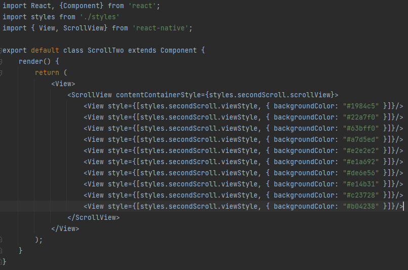
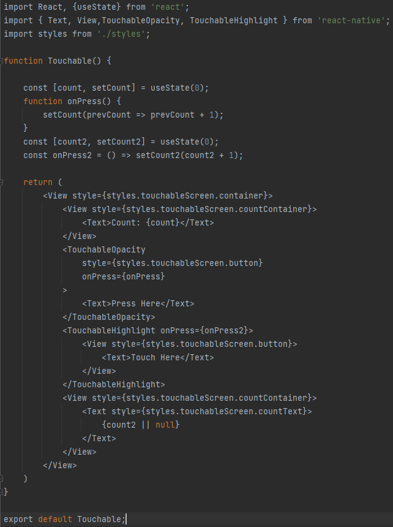
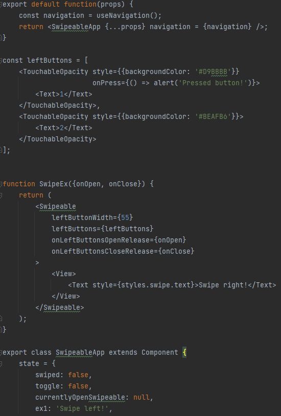
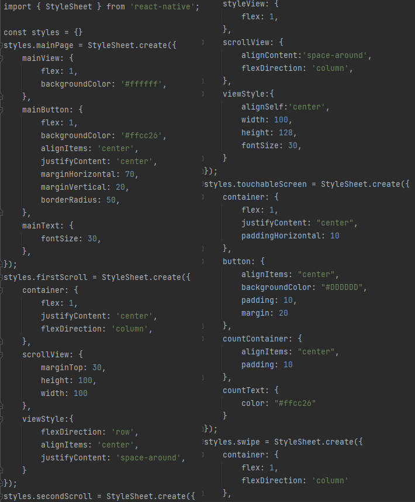

# Laboratorium 5 - obsługa gestów użytkownika

Do stworzenia aplikacji wykorzystałam Reacta i aplikację Expo Go 
(która pozwoliła mi na uruchomienie aplikacji na moim urządzeniu mobilnym z systemem iOS).

### Scroll One View :

### Scroll Two View :

### Touchable :

### Swipeable :

### Styles :

