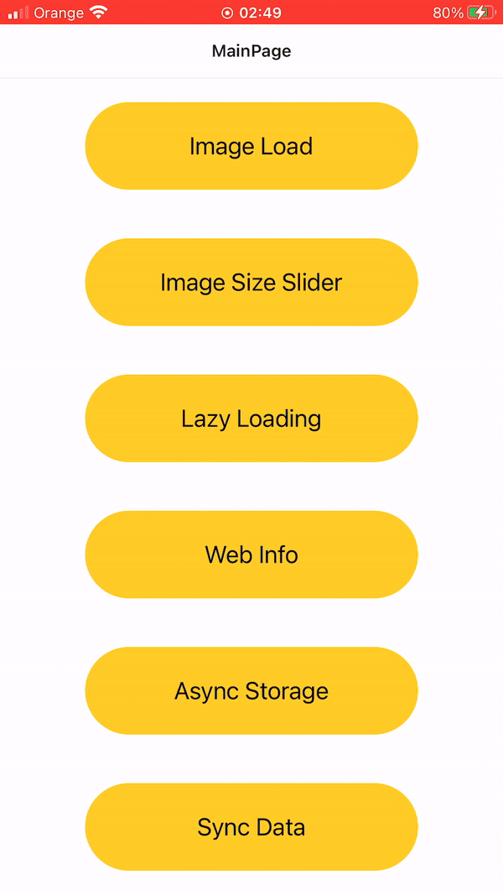
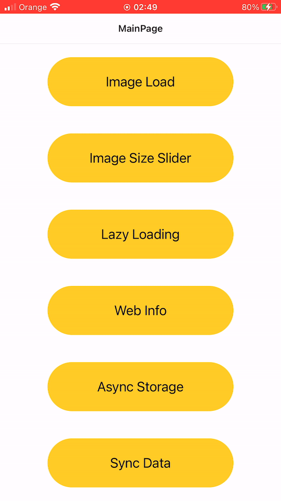
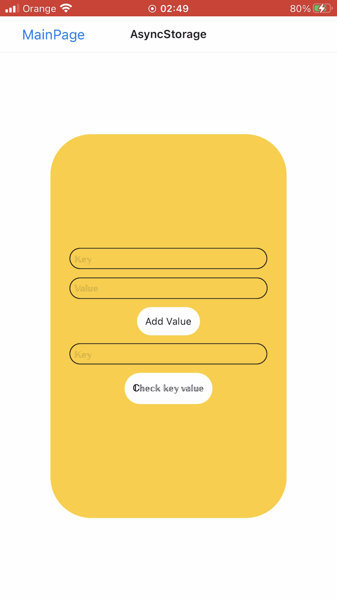
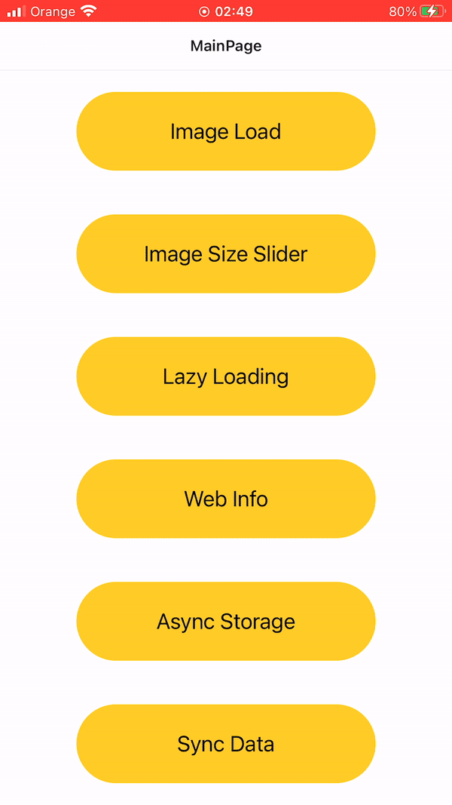

# Laboratorium 6 - obsługa obrazów + tryb offline

Do stworzenia aplikacji wykorzystałam Reacta i aplikację Expo Go 
(która pozwoliła mi na uruchomienie aplikacji na moim urządzeniu mobilnym z systemem iOS).

### Image Load  

ImageLoad.js  

Styl dla ImageLoad.js 

  

### Image Slider  

 

ImageSlider.js  

   

Styl dla ImageSlider.js 

  

### Lazy Loading  

LazyLoading.js  

 
 
 

Styl dla LazyLoading.js 

   

### Web Info  

 

WebInfo.js  

  

Styl dla WebInfo.js  

  

### Async Storage  

AsyncStorage.js  

Styl dla AsyncStorage.js  

 

### Sync Data  

SyncData.js  

Styl dla SyncData.js  

